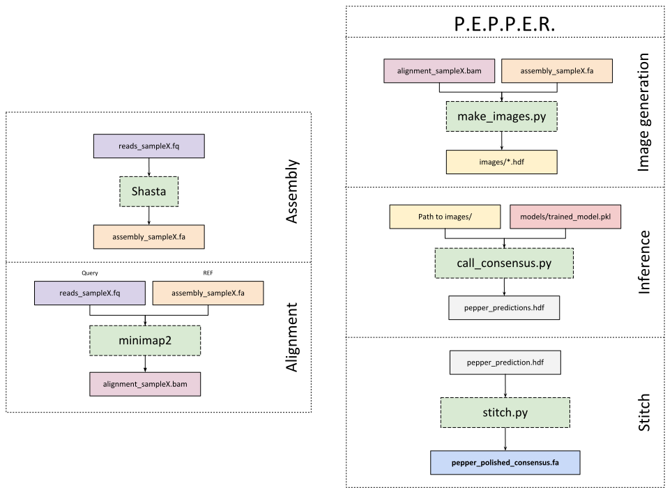
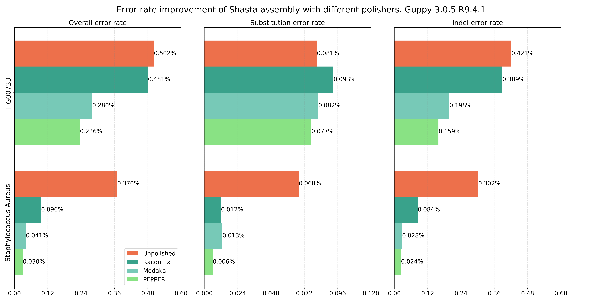
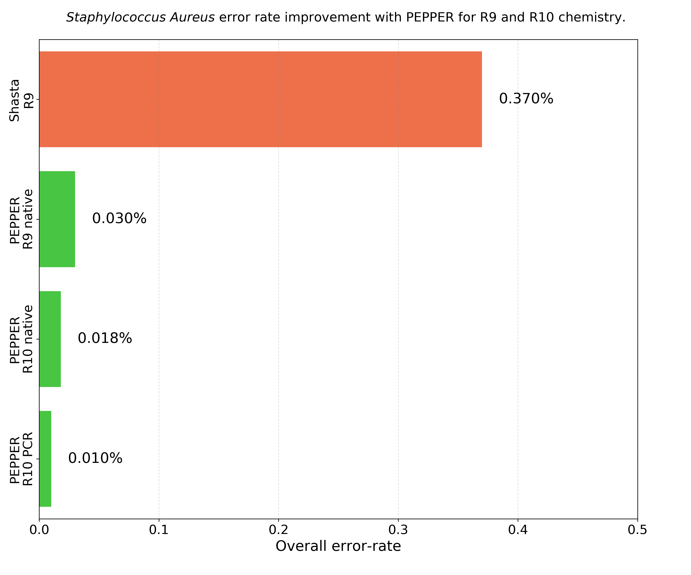

# P.E.P.P.E.R.
###### Program for Evaluating Patterns in the Pileups of Erroneous Reads

[](https://travis-ci.com/kishwarshafin/pepper)
[](https://badge.fury.io/py/pepper-polish)

`P.E.P.P.E.R.` is a deep neural network based polisher designed to work with Oxford Nanopore Sequencing technology. `P.E.P.P.E.R.` uses a Recurrent Neural Network (RNN) based encoder-decoder model to call a consensus sequence from the summary statistics of each genomic position. The local realignment process using [SSW](https://github.com/mengyao/Complete-Striped-Smith-Waterman-Library) is used and the module does not require any prior polishing with other tools (i.e. racon).

© 2020 Kishwar Shafin, Trevor Pesout, Miten Jain, Benedict Paten. <br/>
Computational Genomics Lab (CGL), University of California, Santa Cruz.

## Workflow
 * Sequence a genome and get a basecalled reads file (`reads.fastq`).
 * Use an assembler to get an assembly from the basecalled data (`assembly.fa`).
 * Use [minimap2](https://github.com/lh3/minimap2) to map `reads.fastq` to `assembly.fa` and get a bam file (`reads_2_assembly.bam`).
 * Use `pepper polish` to polish a genome.
 <p align="center">
 
 </p>


## Installation
We recommend using `Linux` environment to run `PEPPER`.

### Install dependencies
```bash
sudo apt-get -y install cmake make git gcc g++ autoconf bzip2 lzma-dev zlib1g-dev \
libcurl4-openssl-dev libpthread-stubs0-dev libbz2-dev \
liblzma-dev libhdf5-dev python3-pip python3-virtualenv
```

###  Install using pip
```bash
python3 -m pip install pepper-polish
# if you get permission error, then try:
python3 -m pip install --user pepper-polish

python3 -m pepper --help
python3 -m pepper polish --help
```
If you want to directly call `PEPPER`. You can do:
```bash
export PATH="$HOME/.local/bin:$PATH" >> ~/.bashrc
source ~/.bashrc

pepper --version
pepper --help
pepper polish --help
```
###  Install from source
We recommend using `virtualenv` to run pepper:
```bash
git clone https://github.com/kishwarshafin/pepper.git
cd pepper
make install
. ./vnev/bin/activate

pepper --help
pepper polish --help
```

## Usage

Polishing involves three sub-processes `make_images`, `call_consensus`, `stitch`. You can run all three steps using `pepper polish` or run each step separately.

###  Download models
You can download all available `PEPPER` models in one command.

```bash
pepper download_models \
--output_dir </path/to/pepper_model_directory/>
```
###  One step polishing
#### Case 1: CPU machine
If you are using a CPU-only machine you ca use the following command:
```bash
pepper polish \
--bam </path/to/reads_2_draft_assembly.bam> \
--fasta <path/to/draft_assembly.fasta> \
--model_path <path/to/pepper/models/XXX.pkl> \
--output_file <path/to/output_polished_sequence/output_file_prefix> \
--threads <total_threads> \
--batch_size 128
```

#### Case 2: GPU machine
You can check your `CUDA` availability by running `pepper torch_stat`. If you have CUDA available and GPU devices on your machine, you can do:
```bash
pepper polish \
--bam </path/to/reads_2_draft_assembly.bam> \
--fasta <path/to/draft_assembly.fasta> \
--model_path <path/to/pepper/models/XXX.pkl> \
--output_file <path/to/output_polished_sequence/output_file_prefix> \
--threads <number_of_threads> \
--batch_size 512 \
--gpu \
--num_workers <num_workers>
```
You can select which `CUDA` devices to use with `--device_ids` parameter.

```bash
ARGUMENT DETAILS:
  -h, --help            show this help message and exit
  -b BAM, --bam BAM     BAM file containing mapping between reads and the
                        draft assembly.
  -f FASTA, --fasta FASTA
                        FASTA file containing the draft assembly.
  -m MODEL_PATH, --model_path MODEL_PATH
                        Path to a trained model.
  -o OUTPUT_FILE, --output_file OUTPUT_FILE
                        Path to output file with an expected prefix (i.e. -o
                        ./outputs/polished_genome)
  -t THREADS, --threads THREADS
                        Number of threads to use. Default is 5.
  -r REGION, --region REGION
                        Region in [contig_name:start-end] format
  -bs BATCH_SIZE, --batch_size BATCH_SIZE
                        Batch size for testing, default is 100. Suggested
                        values: 256/512/1024.
  -g, --gpu             If set then PyTorch will use GPUs for inference. CUDA
                        required.
  -dx, --distributed_off
                        Turn off distributed inference. This mode will disable
                        the use of multiple callers.
  -d_ids DEVICE_IDS, --device_ids DEVICE_IDS
                        List of gpu device ids to use for inference. Only used
                        in distributed setting. Example usage: --device_ids
                        0,1,2 (this will create three callers in id 'cuda:0,
                        cuda:1 and cuda:2' If none then it will use all
                        available devices.
  -w NUM_WORKERS, --num_workers NUM_WORKERS
                        Number of workers for loading images. Default is 4.
  -tpc THREADS_PER_CALLER, --threads_per_caller THREADS_PER_CALLER
                        Total threads to be used per caller. A sane value
                        would be num_callers * threads <= total_threads.
  -c CALLERS, --callers CALLERS
                        Total number of callers to spawn if doing CPU
                        inference in distributed mode.
```

## Results

#### PEPPER achieves lower error rate than ONT suggested pipeline.
We compared `PEPPER` against `Racon-Medaka` pipeline and we demonstrate significantly better results for microbial genomes. We used Staphylococcus Aureus samples to evaluate these two pipelines. The PEPPER microbial model was trained on samples excluding Staphylococcus Aureus. We used `r941_prom_high` model to run `Medaka`.
<p align="center">

</p>

#### New R10 chemistry shows further improvement in polishing results
The new `R10` data is now available for `MinION` and we polished the assembly generated with `R9` data using the `R10` reads. The R10 data provides significant improvement in overall quality of the genome.
<p align="center">

</p>

## Acknowledgement
We are thankful to the developers of these packages: </br>
* [Medaka](https://github.com/nanoporetech/medaka)
* [htslib & samtools](http://www.htslib.org/)
* [ssw library](https://github.com/mengyao/Complete-Striped-Smith-Waterman-Library)
* [hdf5 python (h5py)](https://www.h5py.org/)
* [pytorch](https://pytorch.org/)

## Fun Fact
 <br/>

The name "P.E.P.P.E.R." is also inspired from an A.I. created by Tony Stark in the  Marvel Comics (Earth-616). PEPPER is named after Tony Stark's then friend and the CEO of Resilient, Pepper Potts.


© 2020 Kishwar Shafin, Trevor Pesout, Miten Jain, Benedict Paten.
