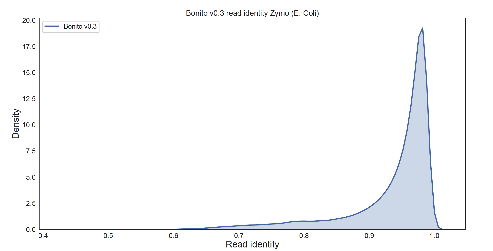

## Polishing Microbial genome assemblies with PEPPER
As PEPPER is now increasingly being used to polish Microbial genome assemblies, we internally benchmarked PEPPER to find the best mode of use. As `Flye` is the most popular Microbial genome assembler, we used `Flye` for this experiment. However, this method works similarly well when paired with `Shasta` assembler. All of the data reported here is generated with Zymo Microbial mock community data with R9.4.1 chemistry.


### Basecaller:
We userd `Bonito V0.3` as the basecaller for this experiment. The median read accuracy with Bonito v0.3 is `0.963508` which is a significantly higher than Guppy.

 </img>


### Generating assembly:

To generate the `Flye` assemblies, we suggest not using the internal polisher of `Flye`. We generated `Flye` assemblies using `--iterations 0` to disable the internal polisher of `Flye`:
```bash
time python3 bin/flye \
--nano-raw \
<reads.fasta> \
--out-dir <output_dir> \
--iterations 0 \
--threads <threads>
```

### Aligning reads to the assembly:
We used `minimap2` to align the reads back to the assembly.

```bash
minimap2 -ax map-ont -t 32 <assembly.fasta> <reads.fasta> | samtools view -hb -F 0x904 > unsorted.bam
samtools sort -@32 -o reads_2_assembly.bam unsorted.bam
rm -rf unsorted.bam
samtools index -@32 reads_2_assembly.bam
```

### Polish with PEPPER:
All of Polishing models are available [here](https://storage.googleapis.com/kishwar-helen/models_pepper/). You can get the model from our github repo, or you can download it from here:
```bash
wget https://storage.googleapis.com/kishwar-helen/models_pepper/PEPPER_POLISH_R941_BONITO_V0.3_MICROBIAL.pkl
```
Now you can run `PEPPER` to polish the assemblies:

```bash
pepper polish \
-b <reads_2_assembly.bam> \
-f <assembly.fasta> \
-m PEPPER_POLISH_R941_BONITO_V0.3_MICROBIAL.pkl \
-t <threads> \
-bs 64 \
-w 1 \
-o <output_dir/prefix>
```

This will provide a polished assembly inside the output directory.

### Results:
We used (https://github.com/jts/assembly_accuracy) to assess the quality of the raw and polished assemblies:


|                        | Raw assembly<br> % Accuracy (Q value) | Polished assembly<br> % Accuracy (Q value) |
|:----------------------:|:-------------------------------------:|:------------------------------------------:|
|  Enterococcus_faecalis |            99.74 (Q 25.93)            |               99.99 (Q 40.00)              |
|    Escherichia_coli    |            99.91 (Q 30.50)            |               99.98 (Q 36.00)              |
| Listeria_monocytogenes |            99.75 (Q 26.06)            |               99.94 (Q 32.00)              |
| Pseudomonas_aeruginosa |            99.72 (Q 25.62)            |               99.98 (Q 37.00)              |
|   Salmonella_enterica  |            99.78 (Q 26.60)            |               99.99 (Q 40.00)              |
|  Staphylococcus_aureus |            99.80 (Q 27.00)            |               99.95 (Q 33.35)              |
