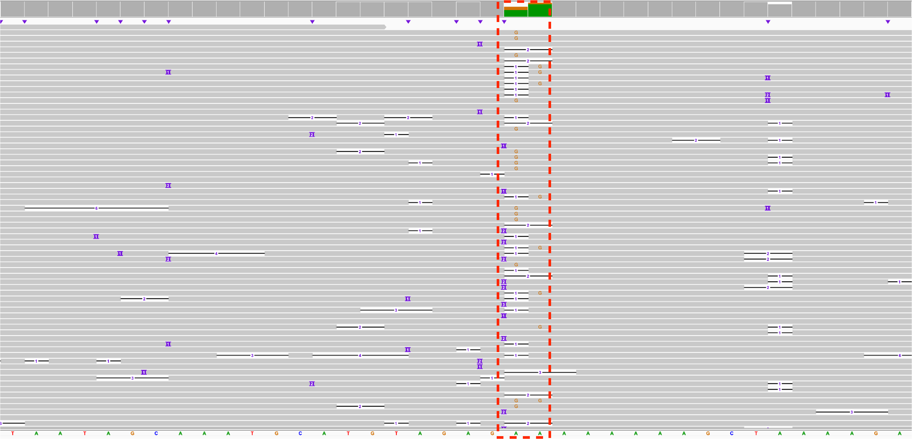
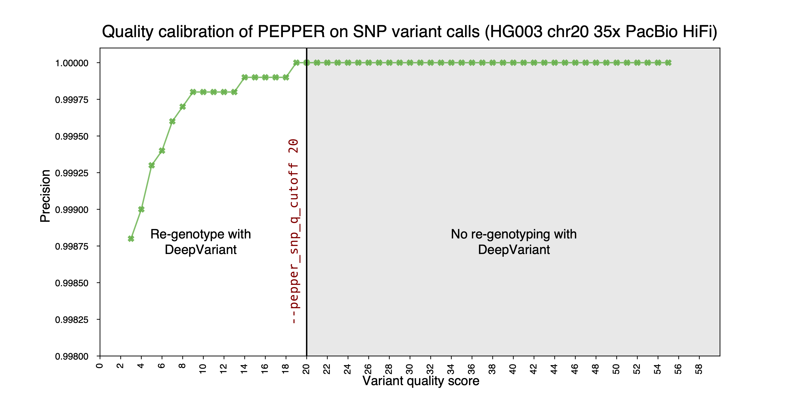
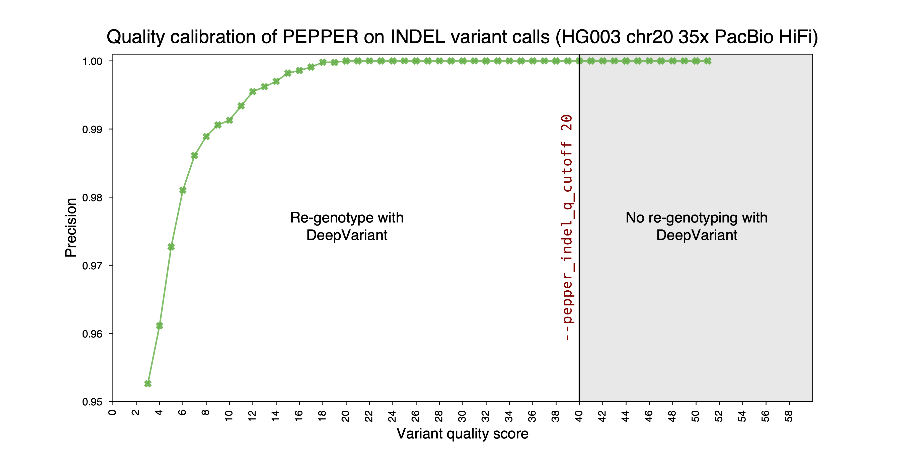
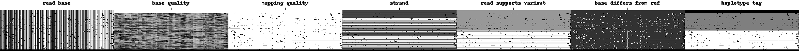

## PEPPER-Margin-DeepVariant methods
## Overview

One of the difficulties in designing inference models for Oxford Nanopore Sequencing technology has been systematic errors in homopolymer regions. The methods we have described in our [manuscript](https://www.nature.com/articles/s41592-021-01299-w) and used upto `r0.5` has a fundamental limitation in these regions. For example, let's look closely at the following genomic region:

<p align="center">

</p>

It is clearly difficult to know which variant is true among all the candidate variants we observe. In our previous versions, we would create one pileup summary (how many times we have observed each base) for the position of interest and could only predict if there's a possibility of having a true variant in that position. The prediction model looked like the following:
```bash
Class ID: prediction
0: AA    5: CC    9: GG  12: TT   14: **
1: AC    6: CG   10: GT  13: T*
2: AG    7: CT   11: G*
3: AT    8: C*    
4: A*
```
In this scheme `*` represented either an insert or a delete. So, we were predicting what is the likelihood of observing a true indel given the summary of that position. With the class balance issue and systematic errors, it is clearly a difficult problem to solve.

In this version, we implemented a prediction scheme of `PEPPER` that can overcome this limitation. We designed a set of features in `PEPPER` that could differentiate the candidates that arise from the same position. That way we can have summaries of candidates arising from the same position with differentiable feature and we can predict the likelihood of a candidate being a true variant given base composition. This also simplified the training process as we now only have to predict `[HET, HOM, HOM-ALT]` for each candidate. Paired with `PEPPER` we re-genotype the variants that have poor quality or confounding predictions with `DeepVariant`. This scheme allows a more accurate and faster variant calling for long read sequencing platforms.

## Description
Following is a description of the updated method:

### Step 1: PEPPER
The first step of the pipeline identifies SNP and INDEL candidates. `PEPPER` module calls variants using the following steps:

i) `make_images`: This step creates summary of potential candidate variants.
* We take all reads with mapping quality above `--pepper_min_mapq`.
* We only consider SNPs with base quality higher than `--pepper_min_snp_baseq` and we only consider INDELs with average base quality higher than `--pepper_min_indel_baseq`. The INDEL base quality only applied on inserts as deletions do not have base quality.
* Then we find positions which have cumulative SNP frequency higher than `--pepper_snp_frequency`, insert frequency `--pepper_insert_frequency` or delete frequency `--pepper_delete_frequency`. We check the SNP, insert and delete threshold independently and see record all candidates that can be potentially a variant. For example, if a site has SNP frequency (any base other than the reference) higher than the threshold, we take all of the SNP alleles in that location as potential candidates.
* Then for each candidate we do another set of filtering, we see if at least `--pepper_candidate_support_threshold` reads support that candidate and the frequency of the allele is above `--pepper_snp_candidate_frequency_threshold` for SNPs or `--pepper_indel_candidate_frequency_threshold` for INDELs.
  * Note, in the previous step, the thresholds are applied to each "site" whereas in this step the thresholds are applied to each candidate. For example, in a genomic position, if the reference base is `A` and we obverse `C, G, T` alts with `0.01, 0.05, 0.2` the frequency for previous step would be `0.01 + 0.05 + 0.2 = 0.26` but in this step, the frequency would be independent and `0.01, 0.05, 0.2` will have to be higher than `--pepper_snp_candidate_frequency_threshold`.
* Finally, once the candidates are selected, we create a summary of read alignment:
<p align="center">

</p>

* Feature descriptions:
  * <b>REF</b>: Encodes the reference base
  * <b>S<sub>L</sub>, I<sub>L</sub>, D<sub>L</sub></b>: Candidate length, for INDELs it encodes the length of the INDEL. S, I, D are used based on the candidate type SNP (S), Insert (I), Delete (D).
  * <b>R<sub>F</sub></b>: How many forward strand reads support the reference allele.
  * <b>S<sub>S</sub>, I<sub>S</sub>, D<sub>S</sub></b>: How many forward strand reads supports the alternate allele. S, I, D are used based on the candidate type SNP (S), Insert (I), Delete (D).
  * <b>A<sub>F</sub>, C<sub>F</sub>, G<sub>F</sub>, T<sub>F</sub></b>: Forward strand read count that expresses each of the bases.
  * <b>I<sub>F</sub></b>: Total inserts observerd from forward strand reads.
  * <b>D<sub>F</sub></b>: Total deletes observerd from forward strand reads anchored to each position.
  * <b>*<sub>F</sub></b>: Total deletes observerd from forward strand reads at each position.

  These features are encoded the same way for reverse strand reads in the following set of features.

ii) `run_inference`: This step runs the trained neural network on generated summary images.
  * We take the images and run the trained neural network on the given summary images. `--pepper_quantized` can be used to make this step faster, but, that introduces non-deterministic behavior.
  * The neural network is trained to predict `[hom (0/0), het (0/1), hom-alt (1/1)]` for each candidate.
  * The `--pepper_model` parameter can be used to use a custom model set for this step.

iii) `find_candidates`: This step takes the predictions of the previous step to filter the candidates that seem erroneous.

  * We take each candidate and it's associated prediction of `P = [hom (0/0), het (0/1), hom-alt (1/1)]`.
    * For a SNP, if the value of `max(P[hom(0/1)], P[hom(1/1)])` is higher than `--pepper_snp_p_value` then it is considered as a candidate.
    * For an insert, if the value of `max(P[hom(0/1)], P[hom(1/1)])` is higher than `--pepper_insert_p_value` then it is considered as a candidate.
    * For a delete, if the value of `max(P[hom(0/1)], P[hom(1/1)])` is higher than `--pepper_delete_p_value` then it is considered as a candidate.
  * We genotype each candidate by taking argmax of `[hom (0/0), het (0/1), hom-alt (1/1)]`. The quality (QUAL) of the variant site is calculated by taking the minimum value of `P[argmax]` class for each candidate in the site.
  * SNP candidate variants with QUAL less than `--pepper_snp_q_cutoff` are re-genotyped with DeepVariant.
  <p align="center">
  
  </p>
  * INDEL candidate variants with QUAL less than `--pepper_indel_q_cutoff` are re-genotyped with DeepVariant.
  <p align="center">
  
  </p>
  * All variants are used for haplotagging with margin.


Update in `r0.8`: From this version, we split the SNP and INDEL candidates into two VCFs to enable SNP and INDEL calling separately with DeepVariant.
The PEPPER output VCFs are:
```bash
PEPPER_VARIANT_FULL.vcf.gz : Contails all variants reported by PEPPER.
PEPPER_VARIANT_OUTPUT_PEPPER.vcf.gz: Contains only the variants that are found high-quality in PEPPER and will not be re-gotyped with DeepVariant.
PEPPER_VARIANT_OUTPUT_VARIANT_CALLING_INDEL.vcf.gz: Contains INDEL candidate variants that will be re-genotyped with DeepVariant.
PEPPER_VARIANT_OUTPUT_VARIANT_CALLING_SNPs.vcf.gz: Contains SNP candidate variants that will be re-genotyped with DeepVariant.
PEPPER_VARIANT_OUTPUT_VARIANT_CALLING.vcf.gz: Contains all candidate variants (SNPs + INDELs) that will be re-genotyped with DeepVariant.
```

For Oxford Nanopore variant calling, we now use:
* DeepVariant `rows` mode that uses INDEL realignment for calling candidate variants from `PEPPER_VARIANT_OUTPUT_VARIANT_CALLING_INDEL.vcf.gz`.
* DeepVariant `none` mode that uses SNP calling for calling candidate variants from `PEPPER_VARIANT_OUTPUT_VARIANT_CALLING_SNPs.vcf.gz`.

### Step 2: Margin [Haplotagging reads]
Margin uses the read-based evidence of linkage between heterozygous variant sites to find the most likely assignment of reads and alleles to haplotypes.
The tool first selects a set of high-quality primary reads and variants for use in the initial phasing workflow.
This selection process preferentially takes longer reads and variants with high allele quality scores, up until certain parameterized thresholds are met.

The Hidden Markov Model describes read partitions at each variant site, enforces compatiblity between partitions at adjacent sites, and determines allele support with read substring alignment likelihoods.
The Forward-Backward algorithm is run to determine partition likelihoods at each site, and a most-likely path through the per-site partitions is produced.
The read partition described by this path is used to calculate allele support per partition, which is used to assign alleles to haplotypes.
Haplotypes for primary reads are determined from this partition, after an iterative refinement step.

Using this set of high-quality phased variants and reads, haplotypes are assigned to the low-quality variants and reads.
Low-quality reads are compared to the high-quality phased variants, and low-quality variants are compared to each set of haplotagged high-quality reads.
The methodolgy of dividing reads and variants into high- and low-quality categories enables the use of only trusted data during the primary analysis, while still allowing a haplotype to be assigned to all input data.

Work is divided into overlapping chunks to enable multithreading.  Stitching is performed using set similarity between haplotype assignments for all reads found in adjacent chunks.

**Note:** The `--margin_haplotag_model` parameter can be used to use a custom parameter set for this step.

#### Specific parameterization

The following parameters are used to exclude reads and variants from the high-quality dataset:

* `phase.onlyUseSNPVCFEntries`: toggles whether INDEL candidates are excluded
* `phase.minSnpVariantQuality`: all SNP variants with a QUAL score below this are excluded
* `phase.minIndelVariantQuality`: all INDEL variants with a QUAL score below this are excluded
* `polish.filterAlignmentsWithMapQBelowThisThreshold`: all reads with a MQ score below this are excluded

The following parameters are used during adaptive sampling.
Adaptive sampling first selects all variants above a threshold, then determines the average distance in basepairs between variants for the chunk.
If the average distance is greater than a threshold (ie, if there are too few variants), then variants are selected in descending order of QUAL score until there are enough variants.

* `phase.useVariantSelectionAdaptiveSampling`: whether to use adaptive sampling
* `phase.variantSelectionAdaptiveSamplingPrimaryThreshold`: above this threshold, all variants are used
* `phase.variantSelectionAdaptiveSamplingDesiredBasepairsPerVariant`: desired average distance between variants

The following parameters are used to select reads:

* `phase.maxDepth`: reads are downsampled to an expected depth of this parameter.  Longer reads are preferentially selected during downsampling.

### Step 3: DeepVariant
DeepVariant re-genotypes the candidates proposed by `PEPPER` using reads haplotagged by `Margin`. We use the following features for DeepVariant:
<p align="center">

</p>

* **Read base**: Base observed at each position.
* **Base quality**: Base quality of each bases.
* **Mapping quality**: Mapping quality of each read
* **Strand**: Forward or reserver strand of read.
* **Read support variant**: If the read supports the candidate variant.
* **Base differs from ref**: If the base is a mismatch compared to the reference base.
* **Haplotype tag**: Haplotype tag (HP:0/HP:1/HP:2) of each read.

We also sort the image based on the haplotype tag.
