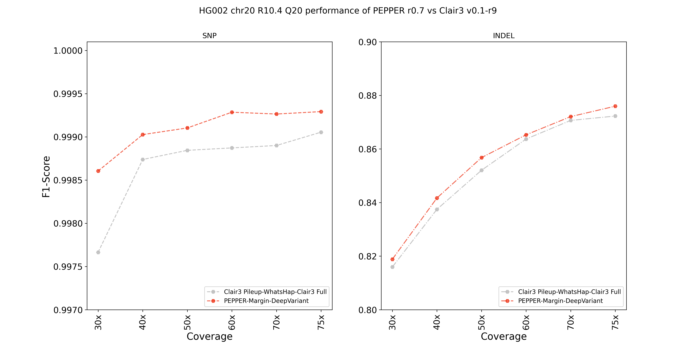

## ONT R10.4 Q20 HG002 chr20 performance evaluation
For ONT variant calling, `PEPPER-Margin-DeepVariant` is often compared against [Clair3](https://github.com/HKU-BAL/Clair3). `Clair3` is developed by [HKUCS Bioinformatics Algorithm Lab](https://github.com/HKU-BAL) and it produces high-quality variant calling results for Oxford Nanopore data. We evaluated the performance of `PEPEPR r0.7` against `Clair3 v0.1-r9` in this evaluation.

We trained `PEPPER-Margin-DeepVariant` on R10.4 Q20 data. In our training scheme, we held out `chr20` from training. Same is reported in the training pipeline of `Clair3`. In this evaluation, we compare the variant calling performance of `PEPPER-Margin-DeepVariant` for HG002 R10.4 Q20 data.

### Setup
We used the following datasets:
```
Sample:                   HG002 (~75x)
Chemistry:                R10.4 Q20
Basecaller:               Guppy 5.0.15 "Sup"
```

#### Downsampling the alignment file:
We downsampled the alignment file using `samtools view`:

```bash
for coverage in 30 40 50 60 70 75
do
  total_coverage=76
  downsample_fraction=0.$((coverage * 100 / total_coverage))
  echo "Coverage= ${coverage}, Downsample fraction = ${downsample_fraction}"

  samtools view -s $downsample_fraction -b -@${THREADS} ONT_R10.4_HG002_pass_2_GRCh38.chr20.bam > ONT_R10.4_HG002_pass_2_GRCh38.{$coverage}x.chr20.bam
  samtools index -@${THREADS} HG002_guppy_507_2_GRCh38_pass.{$coverage}x.chr20.bam
done
```

#### Calling variants with Clair3 (Clair3 v0.1-r9)
We used the following command to call variants with Clair3:
First we downloaded the model from [rerio](https://github.com/nanoporetech/rerio):
```bash
python3 download_models.py --clair3
# This downloaded ont_r104_e81_sup_g5015 which we used for this evaluation
```
Then we ran `Clair3` by running:
```bash
time docker run -it -v /data:/data \
-u `id -u`:`id -g` \
hkubal/clair3:latest \
/opt/bin/run_clair3.sh \
--bam_fn=$BAM \
--ref_fn=$REF \
--ctg_name="chr20" \
--threads=$THREADS \
--platform="ont" \
--model_path="/data/clair3_models/ont_r104_e81_sup_g5015" \
--output=$OUTPUT_DIR
```

Checking the version of Clair3:
```bash
time docker run -it -v /data:/data \
-u `id -u`:`id -g` \
hkubal/clair3:latest \
/opt/bin/run_clair3.sh --version
# Clair3 v0.1-r9
```

#### Calling variants with PEPPER-Margin-DeepVariant (PEPPER r0.7)
For `PEPPER-Margin-DeepVariant` we used the following command:
```bash
time docker run -it -v /data:/data \
-u `id -u`:`id -g` \
kishwars/pepper_deepvariant:r0.7 \
run_pepper_margin_deepvariant call_variant \
-b $BAM \
-f $REF \
-o $PMDV_OUTPUT_DIR \
-t $THREADS \
-s HG002 \
-r chr20 \
--ont_r10_q20
```

### Results
At all coverages `PEPPER-Margin-DeepVariant` outperforms `Clair3` in both SNP and INDEL identification.

#### HG002 chr20 variant calling performance

<p align="center">

</p>

### Data availability

The outputs of `PEPPER` and `Clair3` are publicly available.

**Web console links:**
```bash
# Clair3 outputs:
https://console.cloud.google.com/storage/browser/pepper-deepvariant-public/pepper_r0.7_evaluations/ONT_R10.4_Q20_chr20_evaluation/clair3_outputs/
# PEPPER-Margin-DeepVariant outputs:
https://console.cloud.google.com/storage/browser/pepper-deepvariant-public/pepper_r0.7_evaluations/ONT_R10.4_Q20_chr20_evaluation/pepper_margin_deepvariant_outputs/
```

**Gsutil links:**
```bash
# Clair3 outputs:
gs://pepper-deepvariant-public/pepper_r0.7_evaluations/ONT_R10.4_Q20_chr20_evaluation/clair3_outputs/
# PEPPER-Margin-DeepVariant outputs:
gs://pepper-deepvariant-public/pepper_r0.7_evaluations/ONT_R10.4_Q20_chr20_evaluation/pepper_margin_deepvariant_outputs/
```
