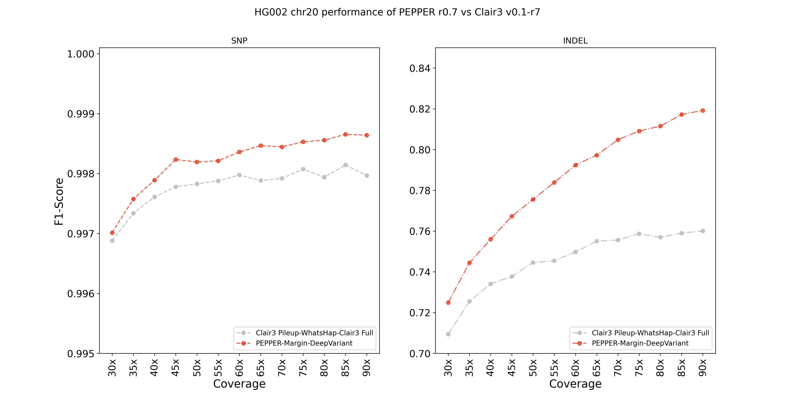
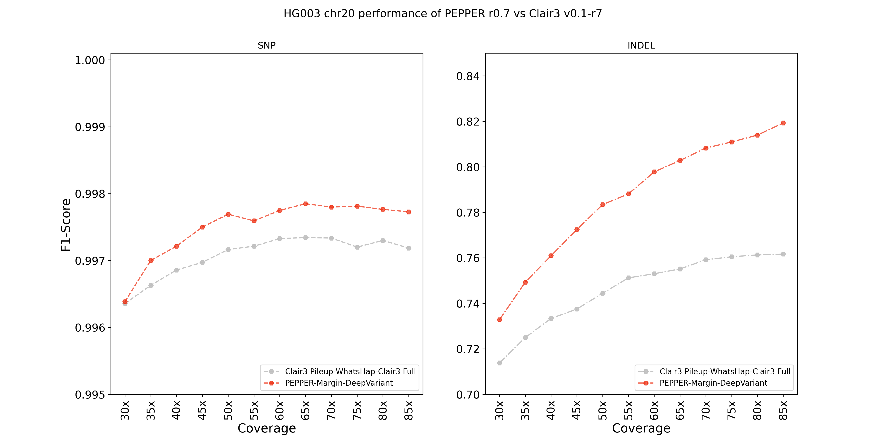
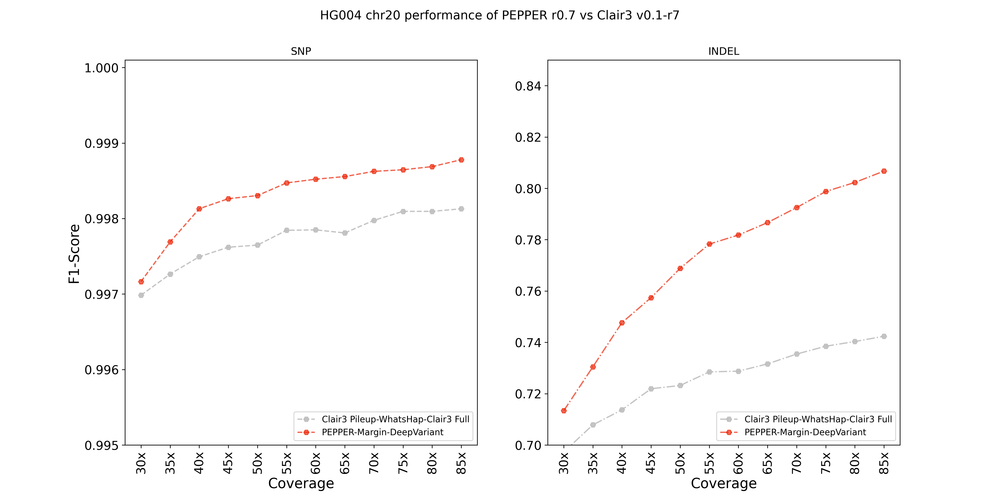
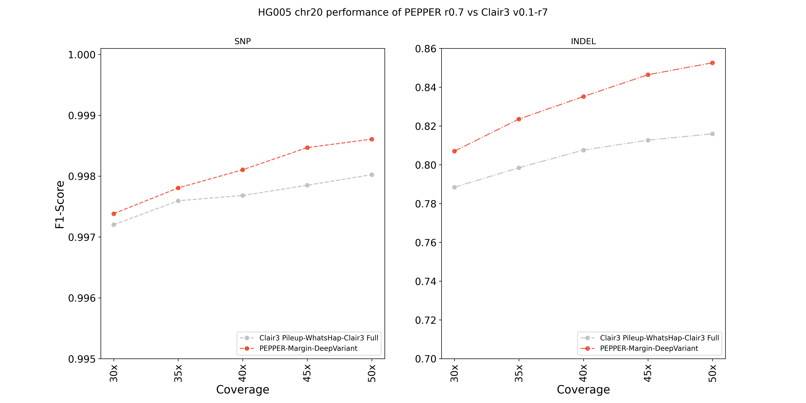
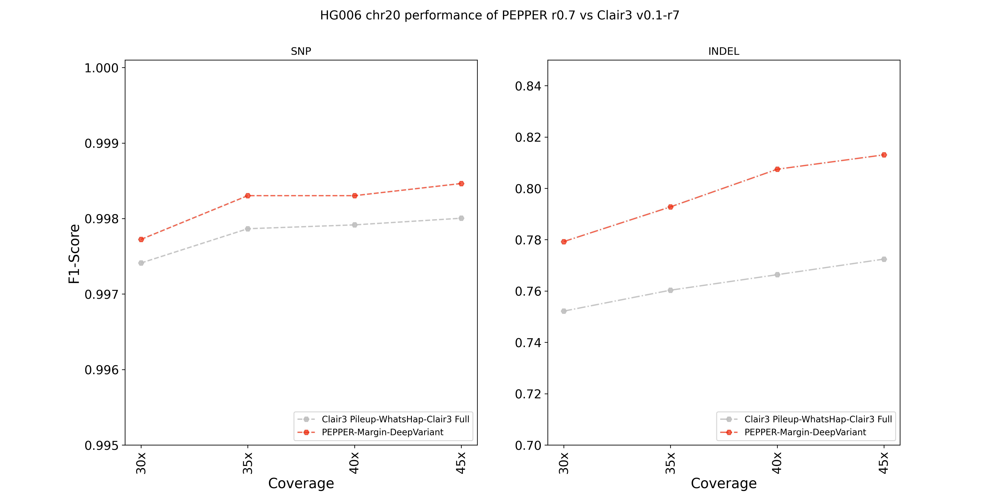

## ONT R9.4.1 Guppy 5.0.7 "Sup" chr20 performance evaluation

In our training scheme, `chr20` is always held out for evaluation. Same is reported in the training scheme of `Clair3`. In this evaluation we report the variant calling performance of `PEPPER-Margin-DeepVariant` on chr20 of five samples (HG002, HG003, HG004, HG005, HG006).

### Runtime evaluation
We only report the variant calling accuracy for this evaluation. The runtime of `Clair3` on `chr20` only often goes beyond 20 mins due to the design bottleneck whereas `PEPPER-Margin-DeepVariant` consistently produces results within 5-10mins with 64CPUs. We could not find a way to fairly compare the runtimes due to this issue. So, we only report the variant calling results.

### Setup
We used `n2-standard-80` GCP instance for this comaprison:
```
Instance type:                   n2-standard-80
Architecture:                    x86_64
CPU op-mode(s):                  32-bit, 64-bit
Byte Order:                      Little Endian
Address sizes:                   46 bits physical, 48 bits virtual
CPU(s):                          80
Model name:                      Intel(R) Xeon(R) CPU @ 2.80GHz
Stepping:                        7
CPU MHz:                         2800.214
BogoMIPS:                        5600.42
```
We used the following datasets:
```
Sample:                   HG002 (~90x), HG003 (~85x), HG004 (~85x), HG005(50x), HG006(45x)
Chemistry:                R9.4.1
Basecaller:               Guppy 5.0.7 "Sup"
```

#### Downsampling the alignment file:
For each sample's alignment file, we first obtained the average coverage by running `samtools depth`. Following is an example on HG002 sample:
```bash
samtools depth -r chr20 HG002_guppy_507_2_GRCh38_pass.bam | awk '{sum+=$3} END { print "Average = ",sum/NR}'
```

Then for each sample, we downsampled the alignment files for different coverages. Following is the example for HG002 sample:
```bash
for coverage in 30 35 40 45 50 55 60 65 70 75 80 85 90
do
  total_coverage=95
  downsample_fraction=0.$((coverage * 100 / total_coverage))
  echo "Coverage= ${coverage}, Downsample fraction = ${downsample_fraction}"

  samtools view -s $downsample_fraction -b -@${THREADS} HG002_guppy_507_2_GRCh38_pass.chr20.bam > HG002_guppy_507_2_GRCh38_pass.{$coverage}x.chr20.bam
  samtools index -@${THREADS} HG002_guppy_507_2_GRCh38_pass.{$coverage}x.chr20.bam
done
```

#### Calling variants with Clair3 (Clair3 v0.1-r7)
We used the following command to call variants with Clair3:
```bash
time docker run -it -v /data:/data \
-u `id -u`:`id -g` \
hkubal/clair3:latest \
/opt/bin/run_clair3.sh \
--bam_fn=$BAM \
--ref_fn=$REF \
--threads=$THREADS \
--platform="ont" \
--model_path="/opt/models/r941_prom_sup_g506" \
--output=$OUTPUT_DIR 2>&1 | tee ${LOG_FILE}
```

Checking the version of Clair3:
```bash
time docker run -it -v /data:/data \
-u `id -u`:`id -g` \
hkubal/clair3:latest \
/opt/bin/run_clair3.sh --version
# Clair3 v0.1-r7
```

#### Calling variants with PEPPER-Margin-DeepVariant (PEPPER r0.7)
For `PEPPER-Margin-DeepVariant` we used the following command:
```bash
time docker run -it -v /data:/data \
-u `id -u`:`id -g` \
kishwars/pepper_deepvariant:r0.7 \
run_pepper_margin_deepvariant call_variant \
-b $BAM \
-f $REF \
-o $OUTPUT_DIR \
-t $THREADS \
-s HG003 \
--ont_r9_guppy5_sup 2>&1 | tee $LOG_FILE
```

### Results
At all coverages and for all samples `PEPPER-Margin-DeepVariant` outperforms `Clair3`.

#### HG002 chr20 variant calling performance

<p align="center">

</p>

#### HG003 chr20 variant calling performance

<p align="center">

</p>

#### HG004 chr20 variant calling performance

<p align="center">

</p>

#### HG005 chr20 variant calling performance
<p align="center">

</p>

#### HG006 chr20 variant calling performance

<p align="center">

</p>

### Data availability

The outputs of `PEPPER` and `Clair3` are publicly available. As there are too many files, we are providing the web console link to the outputs. If convenient then `gsutil` can also be used to obtain the output files:

**Web console links:**
```bash
# Clair3 outputs:
https://console.cloud.google.com/storage/browser/pepper-deepvariant-public/pepper_r0.7_evaluations/ONT_R9.4.1_chr20_evaluation/clair3_outputs
# PEPPER-Margin-DeepVariant outputs:
https://console.cloud.google.com/storage/browser/pepper-deepvariant-public/pepper_r0.7_evaluations/ONT_R9.4.1_chr20_evaluation/pepper_margin_deepvariant_outputs
```

**Gsutil links:**
```bash
# Clair3 outputs:
gs://pepper-deepvariant-public/pepper_r0.7_evaluations/ONT_R9.4.1_chr20_evaluation/clair3_outputs/
# PEPPER-Margin-DeepVariant outputs:
gs://pepper-deepvariant-public/pepper_r0.7_evaluations/ONT_R9.4.1_chr20_evaluation/pepper_margin_deepvariant_outputs/
```
