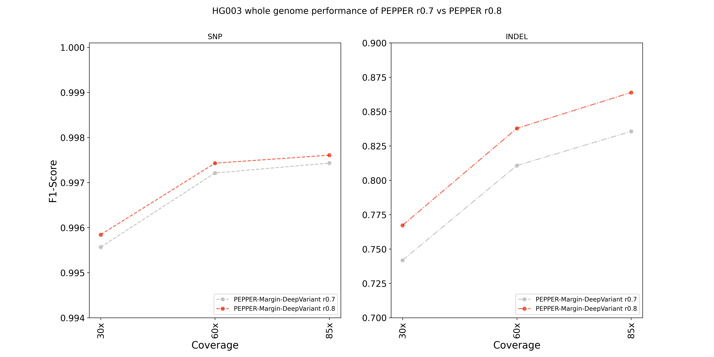

## ONT R9.4.1 Guppy 5.0.7 "Sup" HG003 whole genome performance evaluation
We hold out `HG003` sample while training `PEPPER-Margin-DeepVariant` so we use `HG003` to demonstrate our whole genome performance. We report both runtime and accuracy for this evaluation between PEPPER-Margin-DeepVariant r0.7 and r0.8.

### Setup
We used the following dataset:
```
Sample:                   HG003 (Whole genome)
Coverage:                 ~85x
Chemistry:                R9.4.1
Basecaller:               Guppy 5.0.7 "Sup"
```
#### Downsampling the alignment file:
We downsampled the `~85x` variant calling data using the following command:
```bash
samtools view -s 0.71 -b -@${THREADS} HG003_guppy_507_2_GRCh38_pass.bam > HG003_guppy_507_2_GRCh38_pass.60x.bam
samtools view -s 0.36 -b -@${THREADS} HG003_guppy_507_2_GRCh38_pass.bam > HG003_guppy_507_2_GRCh38_pass.30x.bam
```
#### Calling variants with PEPPER-Margin-DeepVariant (PEPPER r0.8)

```bash
time docker run -it -v /data:/data \
-u `id -u`:`id -g` \
kishwars/pepper_deepvariant:r0.8 \
run_pepper_margin_deepvariant call_variant \
-b $BAM \
-f $REF \
-o $OUTPUT_DIR \
-t $THREADS \
-s HG003 \
--ont_r9_guppy5_sup 2>&1 | tee $LOG_FILE
```

### Results

In all stratified coverages `(30x, 60x, 85x)`, PEPPER-Margin-DeepVariant r0.8 shows increased accuracy:
<p align="center">

</p>

##### HG003 30x performance:
<p align="center">
<table><thead><tr><th>Sample</th><th>Version</th><th>Type</th><th>Truth<br>total</th><th>True<br>positives</th><th>False<br>negatives</th><th>False<br>positives</th><th>Recall</th><th>Precision</th><th>F1-Score</th></tr></thead><tbody><tr><td rowspan="4">HG003 30x</td><td rowspan="2">r0.7</td><td>INDEL</td><td>504501</td><td>317621</td><td>186880</td><td>35084</td><td>0.629575</td><td>0.902714</td><td>0.7418</td></tr><tr><td>SNP</td><td>3327495</td><td>3310002</td><td>17493</td><td>11986</td><td>0.994743</td><td>0.996393</td><td>0.995567</td></tr><tr><td rowspan="2">r0.8</td><td>INDEL</td><td>504501</td><td>345384</td><td>159117</td><td>51842</td><td>0.684605</td><td>0.872481</td><td>0.767209</td></tr><tr><td>SNP</td><td>3327495</td><td>3309038</td><td>18457</td><td>9173</td><td>0.994453</td><td>0.997236</td><td>0.995843</td></tr></tbody></table>
</p>

##### HG003 60x performance:
<p align="center">
<table><thead><tr><th>Sample</th><th>Version</th><th>Type</th><th>Truth<br>total</th><th>True<br>positives</th><th>False<br>negatives</th><th>False<br>positives</th><th>Recall</th><th>Precision</th><th>F1-Score</th></tr></thead><tbody><tr><td rowspan="4">HG003 60x</td><td rowspan="2">r0.7</td><td>INDEL</td><td>504501</td><td>366144</td><td>138357</td><td>33484</td><td>0.725755</td><td>0.91827</td><td>0.810741</td></tr><tr><td>SNP</td><td>3327495</td><td>3317492</td><td>10003</td><td>8548</td><td>0.996994</td><td>0.99743</td><td>0.997212</td></tr><tr><td rowspan="2">r0.8</td><td>INDEL</td><td>504501</td><td>394987</td><td>109514</td><td>44678</td><td>0.782926</td><td>0.90091</td><td>0.837785</td></tr><tr><td>SNP</td><td>3327495</td><td>3317515</td><td>9980</td><td>7120</td><td>0.997001</td><td>0.997859</td><td>0.99743</td></tr></tbody></table>
</p>

##### HG003 85x performance:
<p align="center">
<table><thead><tr><th>Sample</th><th>Version</th><th>Type</th><th>Truth<br>total</th><th>True<br>positives</th><th>False<br>negatives</th><th>False<br>positives</th><th>Recall</th><th>Precision</th><th>F1-Score</th></tr></thead><tbody><tr><td rowspan="4">HG003 85x</td><td rowspan="2">r0.7</td><td>INDEL</td><td>504501</td><td>383384</td><td>121117</td><td>30595</td><td>0.759927</td><td>0.927982</td><td>0.835588</td></tr><tr><td>SNP</td><td>3327495</td><td>3318437</td><td>9058</td><td>8032</td><td>0.997278</td><td>0.997586</td><td>0.997432</td></tr><tr><td rowspan="2">r0.8</td><td>INDEL</td><td>504501</td><td>412169</td><td>92332</td><td>38633</td><td>0.816984</td><td>0.91651</td><td>0.86389</td></tr><tr><td>SNP</td><td>3327495</td><td>3318308</td><td>9187</td><td>6733</td><td>0.997239</td><td>0.997976</td><td>0.997607</td></tr></tbody></table>
</p>
