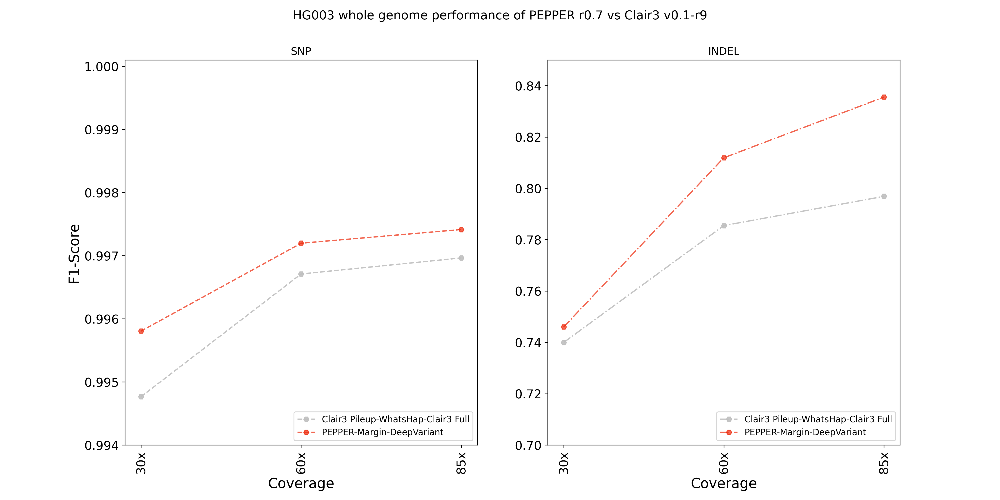

## ONT R9.4.1 Guppy 5.0.7 "Sup" HG003 whole genome performance evaluation against Clair3

We hold out `HG003` sample while training `PEPPER-Margin-DeepVariant` so we use `HG003` to demonstrate our whole genome performance. Although `Clair3` reports that the `R9.4 Guppy 506 SUP` models are trained on `HG003`, we still outperform `Clair3` at a whole genome scale. We report both runtime and accuracy for this evaluation.

### Setup
We used `n2-standard-80` GCP instance for this comaprison:
```
Instance type:                   n2-standard-80
Architecture:                    x86_64
CPU op-mode(s):                  32-bit, 64-bit
Byte Order:                      Little Endian
Address sizes:                   46 bits physical, 48 bits virtual
CPU(s):                          80
Model name:                      Intel(R) Xeon(R) CPU @ 2.80GHz
Stepping:                        7
CPU MHz:                         2800.214
BogoMIPS:                        5600.42
```
We used the following dataset:
```
Sample:                   HG003 (Whole genome)
Coverage:                 ~85x
Chemistry:                R9.4.1
Basecaller:               Guppy 5.0.7 "Sup"
```
#### Downsampling the alignment file:
We downsampled the `~85x` variant calling data using the following command:
```bash
samtools view -s 0.71 -b -@${THREADS} HG003_guppy_507_2_GRCh38_pass.bam > HG003_guppy_507_2_GRCh38_pass.60x.bam
samtools view -s 0.36 -b -@${THREADS} HG003_guppy_507_2_GRCh38_pass.bam > HG003_guppy_507_2_GRCh38_pass.30x.bam
```
#### Calling variants with Clair3 (Clair3 v0.1-r9)
```bash
time docker run -it -v /data:/data \
-u `id -u`:`id -g` \
hkubal/clair3:latest \
/opt/bin/run_clair3.sh \
--bam_fn=$BAM \
--ref_fn=$REF \
--threads=$THREADS \
--platform="ont" \
--model_path="/opt/models/r941_prom_sup_g506" \
--output=$OUTPUT_DIR 2>&1 | tee ${LOG_FILE}
```

Checking the version of Clair3:
```bash
time docker run -it -v /data:/data \
-u `id -u`:`id -g` \
hkubal/clair3:latest \
/opt/bin/run_clair3.sh --version
# Clair3 v0.1-r9
```

#### Calling variants with PEPPER-Margin-DeepVariant (PEPPER r0.7)

```bash
time docker run -it -v /data:/data \
-u `id -u`:`id -g` \
kishwars/pepper_deepvariant:r0.7 \
run_pepper_margin_deepvariant call_variant \
-b $BAM \
-f $REF \
-o $OUTPUT_DIR \
-t $THREADS \
-s HG003 \
--ont_r9_guppy5_sup 2>&1 | tee $LOG_FILE
```

### Results

In all stratified coverages `(30x, 60x, 85x)`, PEPPER-Margin-DeepVariant outperforms Clair3 both in SNP and INDEL accuracy:
<p align="center">

</p>

##### HG003 30x performance:
<p align="center">
<table><thead><tr><th>Sample</th><th>Method</th><th>Type</th><th>Total<br>truth</th><th>True<br>positives</th><th>False<br>negatives</th><th>False<br>positives</th><th>Recall</th><th>Precision</th><th>F1-Score</th></tr></thead><tbody><tr><td rowspan="4">HG003<br>30x</td><td rowspan="2">PEPPER</td><td>INDEL</td><td>504501</td><td>320409</td><td>184092</td><td>34925</td><td>0.635101</td><td>0.903891</td><td>0.746023</td></tr><tr><td>SNP</td><td>3327495</td><td>3310860</td><td>16635</td><td>11263</td><td>0.995001</td><td>0.99661</td><td>0.995805</td></tr><tr><td rowspan="2">Clair3</td><td>INDEL</td><td>504501</td><td>324311</td><td>180190</td><td>48747</td><td>0.642835</td><td>0.871697</td><td>0.739974</td></tr><tr><td>SNP</td><td>3327495</td><td>3306265</td><td>21230</td><td>13569</td><td>0.99362</td><td>0.995914</td><td>0.994765</td></tr></tbody></table>
</p>

##### HG003 60x performance:
<p align="center">
<table><thead><tr><th>Sample</th><th>Method</th><th>Type</th><th>Total<br>truth</th><th>True<br>positives</th><th>False<br>negatives</th><th>False<br>positives</th><th>Recall</th><th>Precision</th><th>F1-Score</th></tr></thead><tbody><tr><td rowspan="4">HG003<br>60x</td><td rowspan="2">PEPPER</td><td>INDEL</td><td>504501</td><td>367041</td><td>137460</td><td>33491</td><td>0.727533</td><td>0.918453</td><td>0.81192</td></tr><tr><td>SNP</td><td>3327495</td><td>3317468</td><td>10027</td><td>8623</td><td>0.996987</td><td>0.997408</td><td>0.997197</td></tr><tr><td rowspan="2">Clair3</td><td>INDEL</td><td>504501</td><td>367699</td><td>136802</td><td>65523</td><td>0.728837</td><td>0.851708</td><td>0.785497</td></tr><tr><td>SNP</td><td>3327495</td><td>3315962</td><td>11533</td><td>10363</td><td>0.996534</td><td>0.996885</td><td>0.99671</td></tr></tbody></table>
</p>

##### HG003 85x performance:
<p align="center">
<table><thead><tr><th>Sample</th><th>Method</th><th>Type</th><th>Total<br>truth</th><th>True<br>positives</th><th>False<br>negatives</th><th>False<br>positives</th><th>Recall</th><th>Precision</th><th>F1-Score</th></tr></thead><tbody><tr><td rowspan="4">HG003<br>85x</td><td rowspan="2">PEPPER</td><td>INDEL</td><td>504501</td><td>383353</td><td>121148</td><td>30583</td><td>0.759866</td><td>0.928003</td><td>0.83556</td></tr><tr><td>SNP</td><td>3327495</td><td>3318424</td><td>9071</td><td>8141</td><td>0.997274</td><td>0.997553</td><td>0.997414</td></tr><tr><td rowspan="2">Clair3</td><td>INDEL</td><td>504501</td><td>379429</td><td>125072</td><td>69997</td><td>0.752088</td><td>0.847351</td><td>0.796883</td></tr><tr><td>SNP</td><td>3327495</td><td>3316989</td><td>10506</td><td>9700</td><td>0.996843</td><td>0.997085</td><td>0.996964</td></tr></tbody></table>
</p>

In all of these evaluations, we observe that `PEPPER` outperforms `Clair3` in both SNP and INDEL accuracy at each coverage.

#### Runtime and accruacy

We further report the runtime of `Clair3` vs `PEPPER`.  In this evaluation we see `Clair3` is faster but produces more errors compares to `PEPPER`. We also note that we have listed several ways to tune our pipeline for speed: [Link](../usage/speed_and_accuracy.md).
<p align="center">
<table><thead><tr><th>Sample</th><th>Runtime</th><th>Method</th><th>Runtime</th><th>SNP<br>F1-score</th><th>INDEL<br>F1-Score</th></tr></thead><tbody><tr><td rowspan="6">HG003</td><td rowspan="2">30x</td><td>PEPPER-Margin-DeepVariant</td><td>207m</td><td>0.9958</td><td>0.746</td></tr><tr><td>Clair3 pileup-WhatsHap-Clair3 full</td><td>161m</td><td>0.9947</td><td>0.7399</td></tr><tr><td rowspan="2">60x</td><td>PEPPER-Margin-DeepVariant</td><td>250m</td><td>0.9971</td><td>0.8119</td></tr><tr><td>Clair3 pileup-WhatsHap-Clair3 full</td><td>151m</td><td>0.9967</td><td>0.7854</td></tr><tr><td rowspan="2">85x</td><td>PEPPER-Margin-DeepVariant</td><td>295m</td><td>0.9974</td><td>0.8355</td></tr><tr><td>Clair3 pileup-WhatsHap-Clair3 full</td><td>171m</td><td>0.9969</td><td>0.7968</td></tr></tbody></table>
</p>


### Data availability

The outputs of `PEPPER` and `Clair3` are publicly available.

#### Clair3 pileup-WhatsHap-Clair3 full files:
VCF files:
```bash
# HG003 30x VCF:
https://storage.googleapis.com/pepper-deepvariant-public/pepper_r0.7_evaluations/HG003_ONT_R9.4.1_whole_genome_evaluation/HG003_wgs_eval/clair3_outputs/HG003_guppy_507_2_GRCh38_clair3_30x/merge_output.vcf.gz
# HG003 60x VCF:
https://storage.googleapis.com/pepper-deepvariant-public/pepper_r0.7_evaluations/HG003_ONT_R9.4.1_whole_genome_evaluation/HG003_wgs_eval/clair3_outputs/HG003_guppy_507_2_GRCh38_clair3_60x/merge_output.vcf.gz
# HG003 85x VCF:
https://storage.googleapis.com/pepper-deepvariant-public/pepper_r0.7_evaluations/HG003_ONT_R9.4.1_whole_genome_evaluation/HG003_wgs_eval/clair3_outputs/HG003_guppy_507_2_GRCh38_clair3_85x/merge_output.vcf.gz
```
Log files:
```bash
# HG003 30x run log:
https://storage.googleapis.com/pepper-deepvariant-public/pepper_r0.7_evaluations/HG003_ONT_R9.4.1_whole_genome_evaluation/HG003_wgs_eval/HG003_guppy507_sup_clair3_30x.log
# HG003 60x run log:
https://storage.googleapis.com/pepper-deepvariant-public/pepper_r0.7_evaluations/HG003_ONT_R9.4.1_whole_genome_evaluation/HG003_wgs_eval/HG003_guppy507_sup_clair3_60x.log
# HG003 85x run log:
https://storage.googleapis.com/pepper-deepvariant-public/pepper_r0.7_evaluations/HG003_ONT_R9.4.1_whole_genome_evaluation/HG003_wgs_eval/HG003_guppy507_sup_clair3_85x.log
```

#### PEPPER-Margin-DeepVariant files:
VCF files:
```bash
# HG003 30x VCF:
https://storage.googleapis.com/pepper-deepvariant-public/pepper_r0.7_evaluations/HG003_ONT_R9.4.1_whole_genome_evaluation/HG003_wgs_eval/pmdv_outputs/HG003_guppy_507_2_GRCh38_pmdv_r0.7_30x/PEPPER_MARGIN_DEEPVARIANT_FINAL_OUTPUT.vcf.gz
# HG003 60x VCF:
https://storage.googleapis.com/pepper-deepvariant-public/pepper_r0.7_evaluations/HG003_ONT_R9.4.1_whole_genome_evaluation/HG003_wgs_eval/pmdv_outputs/HG003_guppy_507_2_GRCh38_pmdv_r0.7_60x/PEPPER_MARGIN_DEEPVARIANT_FINAL_OUTPUT.vcf.gz
# HG003 85x VCF:
https://storage.googleapis.com/pepper-deepvariant-public/pepper_r0.7_evaluations/HG003_ONT_R9.4.1_whole_genome_evaluation/HG003_wgs_eval/pmdv_outputs/HG003_guppy_507_2_GRCh38_pmdv_r0.7_85x/PEPPER_MARGIN_DEEPVARIANT_FINAL_OUTPUT.vcf.gz
```
Log files:
```bash
# HG003 30x run log:
https://storage.googleapis.com/pepper-deepvariant-public/pepper_r0.7_evaluations/HG003_ONT_R9.4.1_whole_genome_evaluation/HG003_wgs_eval/HG003_guppy507_sup_pmdv_r0.7_30x.log
# HG003 60x run log:
https://storage.googleapis.com/pepper-deepvariant-public/pepper_r0.7_evaluations/HG003_ONT_R9.4.1_whole_genome_evaluation/HG003_wgs_eval/HG003_guppy507_sup_pmdv_r0.7_60x.log
# HG003 85x run log:
https://storage.googleapis.com/pepper-deepvariant-public/pepper_r0.7_evaluations/HG003_ONT_R9.4.1_whole_genome_evaluation/HG003_wgs_eval/HG003_guppy507_sup_pmdv_r0.7_85x.log
```
