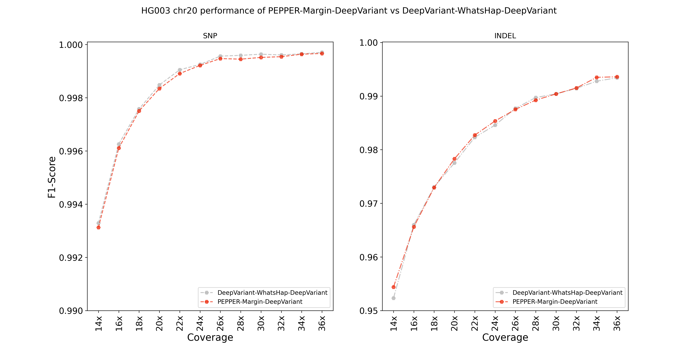

## PacBio HiFi variant calling evaluation

In our training scheme, `chr20` is always held out for evaluation. In this evaluation we compare the performance of `PEPPER-Margin-DeepVariant` against `DeepVariant-WhatsHap-DeepVariant` on HG003 chr20 data.

### Runtime evaluation
`PEPPER-Margin-DeepVariant` is about `~5x` faster than `DeepVariant-WhatsHap-DeepVariant`.

On **HG003 chr20 36x** PacBio HiFi data, `PEPPER-Margin-DeepVariant`takes 5 mins 33 secs to finish on a 72 CPU machine.

| PEPPER | Margin | DeepVariant | Total  |
|--------|--------|-------------|--------|
| 43s    | 29s    | 4m 21s      | 5m 33s |

`DeepVariant-WhatsHap-DeepVariant` on the same sample takes 23 mins 35 seconds.

| DeepVariant | WhatsHap | DeepVariant | Total   |
|-------------|----------|-------------|---------|
| 7m 4s       | 8m 43s   | 7m 48s      | 23m 35s |

### Variant calling accuracy
We compared the variant calling performance of `PEPPER-Margin-DeepVariant` at various coverages of HG003 chr20 PacBio HiFi data. Our analysis show that majority of the times `PEPPER-Margin-DeepVariant` produces better INDEL calls and competitive SNP calls on this data while being `~5x` faster. An illustration of the results and table for detailed comparison:

#### INDEL performance
<table><thead><tr><th>Type</th><th>Coverage</th><th>Method</th><th>True positives</th><th>False negatives</th><th>False positives</th><th>Recall</th><th>Precision</th><th>F1-score</th></tr></thead><tbody><tr><td rowspan="24">INDEL</td><td rowspan="2">14x</td><td>DeepVariant-WhatsHap-DeepVariant</td><td>10035</td><td>593</td><td>427</td><td>0.944204</td><td>0.960587</td><td>0.952325</td></tr><tr><td>PEPPER-Margin-DeepVariant</td><td>10056</td><td>572</td><td>404</td><td>0.94618</td><td>0.962734</td><td>0.954385</td></tr><tr><td rowspan="2">16x</td><td>DeepVariant-WhatsHap-DeepVariant</td><td>10209</td><td>419</td><td>311</td><td>0.960576</td><td>0.971494</td><td>0.966004</td></tr><tr><td>PEPPER-Margin-DeepVariant</td><td>10207</td><td>421</td><td>318</td><td>0.960388</td><td>0.970879</td><td>0.965605</td></tr><tr><td rowspan="2">18x</td><td>DeepVariant-WhatsHap-DeepVariant</td><td>10302</td><td>326</td><td>254</td><td>0.969326</td><td>0.976814</td><td>0.973056</td></tr><tr><td>PEPPER-Margin-DeepVariant</td><td>10297</td><td>331</td><td>251</td><td>0.968856</td><td>0.977067</td><td>0.972944</td></tr><tr><td rowspan="2">20x</td><td>DeepVariant-WhatsHap-DeepVariant</td><td>10365</td><td>263</td><td>222</td><td>0.975254</td><td>0.979822</td><td>0.977533</td></tr><tr><td>PEPPER-Margin-DeepVariant</td><td>10369</td><td>259</td><td>209</td><td>0.97563</td><td>0.98099</td><td>0.978303</td></tr><tr><td rowspan="2">22x</td><td>DeepVariant-WhatsHap-DeepVariant</td><td>10431</td><td>197</td><td>186</td><td>0.981464</td><td>0.983148</td><td>0.982305</td></tr><tr><td>PEPPER-Margin-DeepVariant</td><td>10434</td><td>194</td><td>180</td><td>0.981746</td><td>0.983687</td><td>0.982716</td></tr><tr><td rowspan="2">24x</td><td>DeepVariant-WhatsHap-DeepVariant</td><td>10458</td><td>170</td><td>164</td><td>0.984005</td><td>0.985158</td><td>0.984581</td></tr><tr><td>PEPPER-Margin-DeepVariant</td><td>10463</td><td>165</td><td>152</td><td>0.984475</td><td>0.986236</td><td>0.985355</td></tr><tr><td rowspan="2">26x</td><td>DeepVariant-WhatsHap-DeepVariant</td><td>10487</td><td>141</td><td>125</td><td>0.986733</td><td>0.98868</td><td>0.987705</td></tr><tr><td>PEPPER-Margin-DeepVariant</td><td>10484</td><td>144</td><td>126</td><td>0.986451</td><td>0.988586</td><td>0.987517</td></tr><tr><td rowspan="2">28x</td><td>DeepVariant-WhatsHap-DeepVariant</td><td>10517</td><td>111</td><td>112</td><td>0.989556</td><td>0.989879</td><td>0.989717</td></tr><tr><td>PEPPER-Margin-DeepVariant</td><td>10507</td><td>121</td><td>112</td><td>0.988615</td><td>0.989868</td><td>0.989241</td></tr><tr><td rowspan="2">30x</td><td>DeepVariant-WhatsHap-DeepVariant</td><td>10527</td><td>101</td><td>107</td><td>0.990497</td><td>0.990335</td><td>0.990416</td></tr><tr><td>PEPPER-Margin-DeepVariant</td><td>10521</td><td>107</td><td>101</td><td>0.989932</td><td>0.990867</td><td>0.990399</td></tr><tr><td rowspan="2">32x</td><td>DeepVariant-WhatsHap-DeepVariant</td><td>10540</td><td>88</td><td>98</td><td>0.99172</td><td>0.991147</td><td>0.991434</td></tr><tr><td>PEPPER-Margin-DeepVariant</td><td>10532</td><td>96</td><td>88</td><td>0.990967</td><td>0.992043</td><td>0.991505</td></tr><tr><td rowspan="2">34x</td><td>DeepVariant-WhatsHap-DeepVariant</td><td>10556</td><td>72</td><td>85</td><td>0.993225</td><td>0.992324</td><td>0.992775</td></tr><tr><td>PEPPER-Margin-DeepVariant</td><td>10556</td><td>72</td><td>69</td><td>0.993225</td><td>0.993765</td><td>0.993495</td></tr><tr><td rowspan="2">36x</td><td>DeepVariant-WhatsHap-DeepVariant</td><td>10558</td><td>70</td><td>73</td><td>0.993414</td><td>0.993406</td><td>0.99341</td></tr><tr><td>PEPPER-Margin-DeepVariant</td><td>10558</td><td>70</td><td>69</td><td>0.993414</td><td>0.993765</td><td>0.993589</td></tr></tbody></table>

#### SNP performance
<table><thead><tr><th>Type</th><th>Coverage</th><th>Method</th><th>True positives</th><th>False negatives</th><th>False positives</th><th>Recall</th><th>Precision</th><th>F1-score</th></tr></thead><tbody><tr><td rowspan="24">SNP</td><td rowspan="2">14x</td><td>DeepVariant-WhatsHap-DeepVariant</td><td>69358</td><td>808</td><td>129</td><td>0.988484</td><td>0.998145</td><td>0.993291</td></tr><tr><td>PEPPER-Margin-DeepVariant</td><td>69343</td><td>823</td><td>137</td><td>0.988271</td><td>0.99803</td><td>0.993126</td></tr><tr><td rowspan="2">16x</td><td>DeepVariant-WhatsHap-DeepVariant</td><td>69735</td><td>431</td><td>93</td><td>0.993857</td><td>0.998669</td><td>0.996258</td></tr><tr><td>PEPPER-Margin-DeepVariant</td><td>69723</td><td>443</td><td>102</td><td>0.993686</td><td>0.99854</td><td>0.996108</td></tr><tr><td rowspan="2">18x</td><td>DeepVariant-WhatsHap-DeepVariant</td><td>69891</td><td>275</td><td>64</td><td>0.996081</td><td>0.999086</td><td>0.997581</td></tr><tr><td>PEPPER-Margin-DeepVariant</td><td>69887</td><td>279</td><td>71</td><td>0.996024</td><td>0.998986</td><td>0.997503</td></tr><tr><td rowspan="2">20x</td><td>DeepVariant-WhatsHap-DeepVariant</td><td>70001</td><td>165</td><td>48</td><td>0.997648</td><td>0.999315</td><td>0.998481</td></tr><tr><td>PEPPER-Margin-DeepVariant</td><td>69993</td><td>173</td><td>59</td><td>0.997534</td><td>0.999159</td><td>0.998346</td></tr><tr><td rowspan="2">22x</td><td>DeepVariant-WhatsHap-DeepVariant</td><td>70065</td><td>101</td><td>32</td><td>0.998561</td><td>0.999544</td><td>0.999052</td></tr><tr><td>PEPPER-Margin-DeepVariant</td><td>70058</td><td>108</td><td>45</td><td>0.998461</td><td>0.999359</td><td>0.99891</td></tr><tr><td rowspan="2">24x</td><td>DeepVariant-WhatsHap-DeepVariant</td><td>70088</td><td>78</td><td>27</td><td>0.998888</td><td>0.999615</td><td>0.999252</td></tr><tr><td>PEPPER-Margin-DeepVariant</td><td>70087</td><td>79</td><td>31</td><td>0.998874</td><td>0.999558</td><td>0.999216</td></tr><tr><td rowspan="2">26x</td><td>DeepVariant-WhatsHap-DeepVariant</td><td>70123</td><td>43</td><td>18</td><td>0.999387</td><td>0.999744</td><td>0.999565</td></tr><tr><td>PEPPER-Margin-DeepVariant</td><td>70116</td><td>50</td><td>24</td><td>0.999287</td><td>0.999658</td><td>0.999473</td></tr><tr><td rowspan="2">28x</td><td>DeepVariant-WhatsHap-DeepVariant</td><td>70126</td><td>40</td><td>17</td><td>0.99943</td><td>0.999758</td><td>0.999594</td></tr><tr><td>PEPPER-Margin-DeepVariant</td><td>70118</td><td>48</td><td>29</td><td>0.999316</td><td>0.999587</td><td>0.999451</td></tr><tr><td rowspan="2">30x</td><td>DeepVariant-WhatsHap-DeepVariant</td><td>70134</td><td>32</td><td>19</td><td>0.999544</td><td>0.999729</td><td>0.999637</td></tr><tr><td>PEPPER-Margin-DeepVariant</td><td>70125</td><td>41</td><td>27</td><td>0.999416</td><td>0.999615</td><td>0.999516</td></tr><tr><td rowspan="2">32x</td><td>DeepVariant-WhatsHap-DeepVariant</td><td>70132</td><td>34</td><td>21</td><td>0.999515</td><td>0.999701</td><td>0.999608</td></tr><tr><td>PEPPER-Margin-DeepVariant</td><td>70127</td><td>39</td><td>25</td><td>0.999444</td><td>0.999644</td><td>0.999544</td></tr><tr><td rowspan="2">34x</td><td>DeepVariant-WhatsHap-DeepVariant</td><td>70135</td><td>31</td><td>18</td><td>0.999558</td><td>0.999744</td><td>0.999651</td></tr><tr><td>PEPPER-Margin-DeepVariant</td><td>70134</td><td>32</td><td>19</td><td>0.999544</td><td>0.999729</td><td>0.999637</td></tr><tr><td rowspan="2">36x</td><td>DeepVariant-WhatsHap-DeepVariant</td><td>70141</td><td>25</td><td>16</td><td>0.999644</td><td>0.999772</td><td>0.999708</td></tr><tr><td>PEPPER-Margin-DeepVariant</td><td>70138</td><td>28</td><td>19</td><td>0.999601</td><td>0.999729</td><td>0.999665</td></tr></tbody></table>
