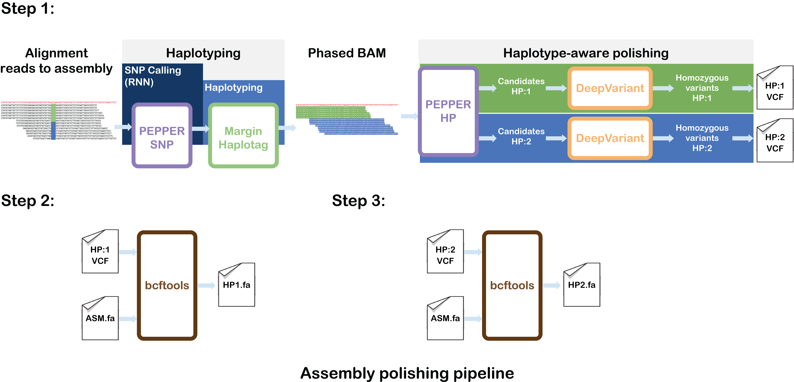

## Oxford Nanopore assembly polishing with PacBio HiFi reads
PEPPER-Margin-DeepVariant can be used to polish nanopore-based assemblies in a diploid manner.



----

### HG002 chr20 Shasta assembly polishing case-study
Here we evaluate our pipeline on Shasta assembly and polish it with `~35x` PacBio HiFi data.
```bash
Sample:     HG002
Assembler:  Shasta
Data:       PacBio HiFi
Coverage:   ~35x
Region:     chr20
```

#### Command-line instructions
##### Step 1: Install docker
Please install docker and wget if you don't have it installed already. You can install docker for other distros from here:
* [CentOS](https://docs.docker.com/engine/install/centos/) docker installation guide
* [Debian/Raspbian](https://docs.docker.com/engine/install/debian/) docker installation guide
* [Fedora](https://docs.docker.com/engine/install/fedora/) installation guide
* [Ubuntu](https://docs.docker.com/engine/install/ubuntu/) installation guide

We show the installation instructions for Ubuntu here:
```bash
# Install wget to download data files.
sudo apt-get -qq -y update
sudo apt-get -qq -y install wget

# Install docker using instructions on:
# https://docs.docker.com/install/linux/docker-ce/ubuntu/
sudo apt-get -qq -y install apt-transport-https ca-certificates curl gnupg-agent software-properties-common
curl -fsSL https://download.docker.com/linux/ubuntu/gpg | sudo apt-key add -

sudo add-apt-repository \
"deb [arch=amd64] https://download.docker.com/linux/ubuntu \
$(lsb_release -cs) \
stable"

sudo apt-get -qq -y update
sudo apt-get -qq -y install docker-ce
docker --version

# To add the user to avoid running docker with sudo:
# Details: https://docs.docker.com/engine/install/linux-postinstall/

sudo groupadd docker
sudo usermod -aG docker $USER

# Log out and log back in so that your group membership is re-evaluated.

# After logging back in.
docker run hello-world

# If you can run docker without sudo then change the following commands accordingly.
```

##### Step 2: Download and prepare input data
```bash
BASE="${HOME}/hifi-polishing-case-study"

# Set up input data
INPUT_DIR="${BASE}/input/data"
ASM="HG002_Shasta_run1.chr20.fa"
BAM="HG002_HiFi_35x_2_Shasta_assembly.chr20.bam"
SAMPLE_NAME="HG002"
# Set the number of CPUs to use
THREADS="64"

# Set up output directory
OUTPUT_DIR="${BASE}/output"

## Create local directory structure
mkdir -p "${OUTPUT_DIR}"
mkdir -p "${INPUT_DIR}"

# Download the data to input directory
wget -P ${INPUT_DIR} https://storage.googleapis.com/pepper-deepvariant-public/usecase_data/HG002_HiFi_35x_2_Shasta_assembly.chr20.bam
wget -P ${INPUT_DIR} https://storage.googleapis.com/pepper-deepvariant-public/usecase_data/HG002_HiFi_35x_2_Shasta_assembly.chr20.bam.bai
wget -P ${INPUT_DIR} https://storage.googleapis.com/pepper-deepvariant-public/usecase_data/HG002_Shasta_run1.chr20.fa
wget -P ${INPUT_DIR} https://storage.googleapis.com/pepper-deepvariant-public/usecase_data/HG002_Shasta_run1.chr20.fa.fai
```

##### Step 3: Run PEPPER-Margin-DeepVariant
```bash
## Pull the docker image.
sudo docker pull kishwars/pepper_deepvariant:r0.4

# Run PEPPER-Margin-DeepVariant
sudo docker run --ipc=host \
-v "${INPUT_DIR}":"${INPUT_DIR}" \
-v "${OUTPUT_DIR}":"${OUTPUT_DIR}" \
kishwars/pepper_deepvariant:r0.4 \
run_pepper_margin_deepvariant polish_assembly \
-b "${INPUT_DIR}/${BAM}" \
-f "${INPUT_DIR}/${ASM}" \
-o "${OUTPUT_DIR}" \
-t ${THREADS} \
-s ${SAMPLE_NAME} \
--ccs

# this generates 2 VCFs, one per haplotype
HAP1_VCF=PEPPER_MARGIN_DEEPVARIANT_ASM_POLISHED_HAP1.vcf.gz
HAP2_VCF=PEPPER_MARGIN_DEEPVARIANT_ASM_POLISHED_HAP2.vcf.gz

POLISHED_ASM_HAP1=HG002_Shasta_run1.PMDV.HiFi_polished.HAP1.fasta
POLISHED_ASM_HAP2=HG002_Shasta_run1.PMDV.HiFi_polished.HAP2.fasta

# Apply the VCF to the assembly
sudo docker run --ipc=host \
-v "${INPUT_DIR}":"${INPUT_DIR}" \
-v "${OUTPUT_DIR}":"${OUTPUT_DIR}" \
kishwars/pepper_deepvariant:r0.4 \
bcftools consensus \
-f "${INPUT_DIR}/${ASM}" \
-H 2 \
-s "${SAMPLE_NAME}" \
-o "${OUTPUT_DIR}/${POLISHED_ASM_HAP1}" \
"${OUTPUT_DIR}/${HAP1_VCF}"

sudo docker run --ipc=host \
-v "${INPUT_DIR}":"${INPUT_DIR}" \
-v "${OUTPUT_DIR}":"${OUTPUT_DIR}" \
kishwars/pepper_deepvariant:r0.4 \
bcftools consensus \
-f "${INPUT_DIR}/${ASM}" \
-H 2 \
-s "${SAMPLE_NAME}" \
-o "${OUTPUT_DIR}/${POLISHED_ASM_HAP2}" \
"${OUTPUT_DIR}/${HAP2_VCF}"

# HG002_Shasta_run1.PMDV.HiFi_polished.HAP1.fasta and HG002_Shasta_run1.PMDV.HiFi_polished.HAP2.fasta are the polished assemblies.
```

### Evaluation of the polished assemblies using hap.py (Optional)
You can evaluate the variants using `hap.py`.

Download benchmarking data:
```bash
# Set up input data
REF="GRCh38_no_alt.chr20.fa"
TRUTH_VCF="HG002_GRCh38_1_22_v4.2.1_benchmark.vcf.gz"
TRUTH_BED="HG002_GRCh38_1_22_v4.2.1_benchmark_noinconsistent.bed"
OUTPUT_DIR_ASM_TO_REF=${OUTPUT_DIR}/asm_to_ref_vcf_output/

# Create output directory
mkdir -p ${OUTPUT_DIR_ASM_TO_REF}

# Download truth VCFs
wget -P ${INPUT_DIR} https://storage.googleapis.com/pepper-deepvariant-public/usecase_data/HG002_GRCh38_1_22_v4.2.1_benchmark.vcf.gz
wget -P ${INPUT_DIR} https://storage.googleapis.com/pepper-deepvariant-public/usecase_data/HG002_GRCh38_1_22_v4.2.1_benchmark_noinconsistent.bed
wget -P ${INPUT_DIR} https://storage.googleapis.com/pepper-deepvariant-public/usecase_data/GRCh38_no_alt.chr20.fa
wget -P ${INPUT_DIR} https://storage.googleapis.com/pepper-deepvariant-public/usecase_data/GRCh38_no_alt.chr20.fa.fai
```

Apply the assembly back to the GRCh38 reference
```bash
# pull the docker
sudo docker pull kishwars/asm_to_ref_vcf:latest

# apply the assembly to the reference using dipcall
sudo docker run -it \
-v "${INPUT_DIR}":"${INPUT_DIR}" \
-v "${OUTPUT_DIR}":"${OUTPUT_DIR}" \
kishwars/asm_to_ref_vcf:latest /opt/asm_to_ref_vcf.sh \
-a "${INPUT_DIR}/${ASM}" \
-m "${OUTPUT_DIR}/${HAP1_VCF}" \
-p "${OUTPUT_DIR}/${HAP2_VCF}" \
-r "${INPUT_DIR}/${REF}" \
-s ${SAMPLE_NAME} \
-o "${OUTPUT_DIR_ASM_TO_REF}"

OUTPUT_REF_TO_VCF=ref_dipcall_output.vcf.gz

# Pull the docker image
sudo docker pull jmcdani20/hap.py:v0.3.12

# Run hap.py
sudo docker run -it \
-v "${INPUT_DIR}":"${INPUT_DIR}" \
-v "${OUTPUT_DIR}":"${OUTPUT_DIR}" \
jmcdani20/hap.py:v0.3.12 /opt/hap.py/bin/hap.py \
${INPUT_DIR}/${TRUTH_VCF} \
${OUTPUT_DIR_ASM_TO_REF}/${OUTPUT_REF_TO_VCF} \
-f "${INPUT_DIR}/${TRUTH_BED}" \
-r "${INPUT_DIR}/${REF}" \
-o "${OUTPUT_DIR}/happy.output" \
--pass-only \
-l chr20 \
--engine=vcfeval \
--threads="${THREADS}"
```

**Expected output:**

|  Type | Truth<br>total | True<br>positives | False<br>negatives | False<br>positives |  Recall  | Precision | F1-Score |
|:-----:|:--------------:|:-----------------:|:------------------:|:------------------:|:--------:|:---------:|:--------:|
| INDEL |      11256     |       10223       |        1033        |        1080        | 0.908227 |  0.906631 | 0.907428 |
|  SNP  |      71333     |       70058       |        1275        |         249        | 0.982126 |  0.996463 | 0.989243 |

### Authors:
This pipeline is developed in a collaboration between UCSC genomics institute and the genomics team at Google health.
