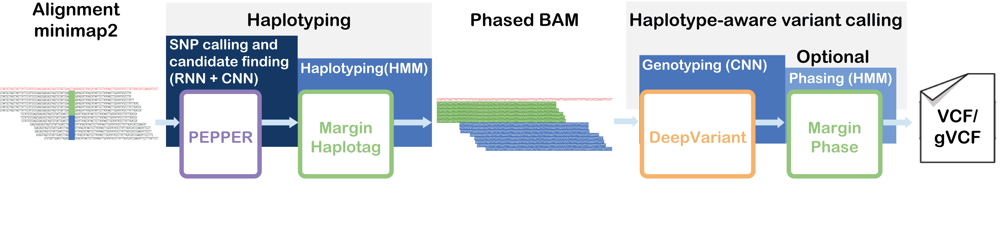

## PacBio HiFi variant calling workflow [ON GPU]
PEPPER-Margin-DeepVariant is a haplotype-aware variant calling pipeline for long reads.



----
### PacBio HiFi HG003 chr20 case-study
We evaluated this pipeline on `~35x` HG002 data. The data is publicly available, please feel free to download, run and evaluate the pipeline.
```bash
Sample:     HG003
Coverage:   ~35x
Region:     chr20
Reference:  GRCh38_no_alt
```

#### Command-line instructions

##### Step 1: Install CUDA and NVIDIA-docker
<details>
<summary>
Expand to see <b>CUDA + NVIDIA-docker</b> installation guide.
</summary>

##### Preprocessing: Install CUDA [must be installed by root]
Install CUDA toolkit 11.0 from the [CUDA archive](https://developer.nvidia.com/cuda-toolkit-archive).

Here are the instructions to install CUDA 11.0 on Ubuntu 20.04LTS:
```bash
# Verify you have CUDA capable GPUs:
lspci | grep -i nvidia

# Verify Linux version
uname -m && cat /etc/*release
# Expected output: x86_64

sudo apt-get -qq -y update
sudo apt-get -qq -y install gcc wget make

# Install proper kernel headers: This is for ubuntu
# Details: https://docs.nvidia.com/cuda/cuda-installation-guide-linux/index.html
sudo apt-get install linux-headers-$(uname -r)

wget https://developer.download.nvidia.com/compute/cuda/11.2.0/local_installers/cuda_11.2.0_460.27.04_linux.run
sudo sh cuda_11.2.0_460.27.04_linux.run
```
##### Step 1.1: Install docker
Please install docker and wget if you don't have it installed already. You can install docker for other distros from here:
* [CentOS](https://docs.docker.com/engine/install/centos/) docker installation guide
* [Debian/Raspbian](https://docs.docker.com/engine/install/debian/) docker installation guide
* [Fedora](https://docs.docker.com/engine/install/fedora/) installation guide
* [Ubuntu](https://docs.docker.com/engine/install/ubuntu/) installation guide

We show the installation instructions for Ubuntu here:
```bash
# Install wget to download data files.
sudo apt-get -qq -y update
sudo apt-get -qq -y install wget

# Install docker using instructions on:
# https://docs.docker.com/install/linux/docker-ce/ubuntu/
sudo apt-get -qq -y install apt-transport-https ca-certificates curl gnupg-agent software-properties-common
curl -fsSL https://download.docker.com/linux/ubuntu/gpg | sudo apt-key add -

sudo add-apt-repository \
"deb [arch=amd64] https://download.docker.com/linux/ubuntu \
$(lsb_release -cs) \
stable"

sudo apt-get -qq -y update
sudo apt-get -qq -y install docker-ce
docker --version

# To add the user to avoid running docker with sudo:
# Details: https://docs.docker.com/engine/install/linux-postinstall/

sudo groupadd docker
sudo usermod -aG docker $USER

# Log out and log back in so that your group membership is re-evaluated.

# After logging back in.
docker run hello-world

# If you can run docker without sudo then change the following commands accordingly.
```

##### Step 1.1: Install nvidia-docker
Install nvidia docker following these [instructions](https://docs.nvidia.com/datacenter/cloud-native/container-toolkit/install-guide.html#getting-started).

```bash
distribution=$(. /etc/os-release;echo $ID$VERSION_ID) \
&& curl -s -L https://nvidia.github.io/nvidia-docker/gpgkey | sudo apt-key add - \
&& curl -s -L https://nvidia.github.io/nvidia-docker/$distribution/nvidia-docker.list | sudo tee /etc/apt/sources.list.d/nvidia-docker.list

sudo apt-get update

sudo apt-get install -y nvidia-docker2

sudo systemctl restart docker

sudo docker run --rm --gpus all nvidia/cuda:11.0-base nvidia-smi
# The output show show all your GPUs, if you enabled Docker for users then you should be able to run nvidia-docker without sudo
```
</details>

##### Step 2: Download and prepare input data
```bash
BASE="${HOME}/hifi-case-study"

# Set up input data
INPUT_DIR="${BASE}/input/data"
REF="GRCh38_no_alt.chr20.fa"
BAM="HG003.GRCh38.chr20.pFDA_truthv2.bam"
OUTPUT_PREFIX="HG002_HiFi_35x_2_GRCh38_PEPPER_Margin_DeepVariant.chr20"
OUTPUT_VCF="HG002_HiFi_35x_2_GRCh38_PEPPER_Margin_DeepVariant.chr20.vcf.gz"

# Set the number of CPUs to use
THREADS="64"

# Set up output directory
OUTPUT_DIR="${BASE}/output"

## Create local directory structure
mkdir -p "${OUTPUT_DIR}"
mkdir -p "${INPUT_DIR}"

# Download the data to input directory
wget -P ${INPUT_DIR} https://downloads.pacbcloud.com/public/dataset/HG003/deepvariant-case-study/HG003.GRCh38.chr20.pFDA_truthv2.bam
wget -P ${INPUT_DIR} https://downloads.pacbcloud.com/public/dataset/HG003/deepvariant-case-study/HG003.GRCh38.chr20.pFDA_truthv2.bam.bai
wget -P ${INPUT_DIR} https://storage.googleapis.com/pepper-deepvariant-public/usecase_data/GRCh38_no_alt.chr20.fa
wget -P ${INPUT_DIR} https://storage.googleapis.com/pepper-deepvariant-public/usecase_data/GRCh38_no_alt.chr20.fa.fai
```

##### Step 3: Run PEPPER-Margin-DeepVariant
```bash
## Pull the docker image.
sudo docker pull kishwars/pepper_deepvariant:r0.8-gpu

# Run PEPPER-Margin-DeepVariant
sudo docker run --ipc=host \
--gpus all \
-v "${INPUT_DIR}":"${INPUT_DIR}" \
-v "${OUTPUT_DIR}":"${OUTPUT_DIR}" \
kishwars/pepper_deepvariant:r0.8-gpu \
run_pepper_margin_deepvariant call_variant \
-b "${INPUT_DIR}/${BAM}" \
-f "${INPUT_DIR}/${REF}" \
-o "${OUTPUT_DIR}" \
-p "${OUTPUT_PREFIX}" \
-t ${THREADS} \
-g \
--hifi
```
###### Evaluation using hap.py (Optional)
You can evaluate the variants using `hap.py`.
Download benchmarking data:
```bash
# Set up input data
TRUTH_VCF="HG003_GRCh38_1_22_v4.2.1_benchmark.vcf.gz"
TRUTH_BED="HG003_GRCh38_1_22_v4.2.1_benchmark_noinconsistent.bed"

# Download truth VCFs
wget -P ${INPUT_DIR} ftp://ftp-trace.ncbi.nlm.nih.gov/giab/ftp/release/AshkenazimTrio/HG003_NA24149_father/NISTv4.2.1/GRCh38/HG003_GRCh38_1_22_v4.2.1_benchmark_noinconsistent.bed
wget -P ${INPUT_DIR} ftp://ftp-trace.ncbi.nlm.nih.gov/giab/ftp/release/AshkenazimTrio/HG003_NA24149_father/NISTv4.2.1/GRCh38/HG003_GRCh38_1_22_v4.2.1_benchmark.vcf.gz
wget -P ${INPUT_DIR} ftp://ftp-trace.ncbi.nlm.nih.gov/giab/ftp/release/AshkenazimTrio/HG003_NA24149_father/NISTv4.2.1/GRCh38/HG003_GRCh38_1_22_v4.2.1_benchmark.vcf.gz.tbi
```

Run hap.py:
```bash
# Pull the docker image
sudo docker pull jmcdani20/hap.py:v0.3.12

# Run hap.py
sudo docker run -it \
-v "${INPUT_DIR}":"${INPUT_DIR}" \
-v "${OUTPUT_DIR}":"${OUTPUT_DIR}" \
jmcdani20/hap.py:v0.3.12 /opt/hap.py/bin/hap.py \
${INPUT_DIR}/${TRUTH_VCF} \
${OUTPUT_DIR}/${OUTPUT_VCF} \
-f "${INPUT_DIR}/${TRUTH_BED}" \
-r "${INPUT_DIR}/${REF}" \
-o "${OUTPUT_DIR}/happy.output" \
--pass-only \
-l chr20 \
--engine=vcfeval \
--threads="${THREADS}"
```

**Expected output:**

|  Type | Truth<br>total | True<br>positives | False<br>negatives | False<br>positives |  Recall  | Precision | F1-Score |
|:-----:|:--------------:|:-----------------:|:------------------:|:------------------:|:--------:|:---------:|:--------:|
| INDEL |      10628     |       10558       |         64         |         75         | 0.993978 |  0.993233 | 0.993605 |
|  SNP  |      70166     |       70137       |         26         |         15         | 0.999629 |  0.999786 | 0.999708 |

### Authors:
This pipeline is developed in a collaboration between UCSC genomics institute and the genomics team at Google health.
