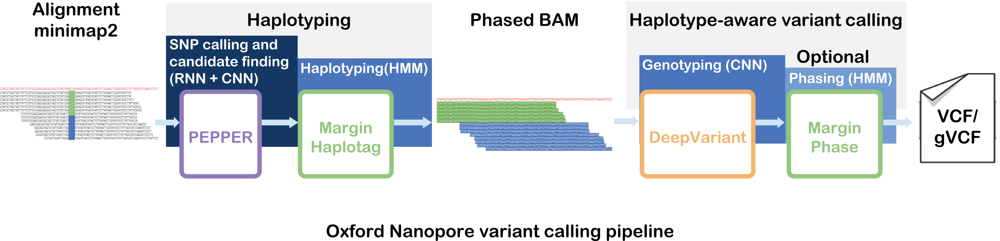

## Oxford Nanopore R9.4.1 variant calling workflow [Using singularity]
PEPPER-Margin-DeepVariant is a haplotype-aware variant calling pipeline for long reads.



----

### HG002 chr20 case-study
We evaluated this pipeline on `~90x` HG002 data. The data is publicly available, please feel free to download, run and evaluate the pipeline.
```bash
Sample:     HG002
Coverage:   ~25-90x
Basecaller: Guppy 5.0.7 "SUP"
Region:     chr20
Reference:  GRCh38_no_alt
```

#### Command-line instructions
##### Step 1: Install singularity [must be installed by root]
<details>
<summary>
Expand to see singularity installation guide.
</summary>

Please install [Singularity](https://sylabs.io/guides/3.7/user-guide/quick_start.html#quick-installation-steps). This must be installed by the system admin.

Follow these installation [instructions](https://sylabs.io/guides/3.7/user-guide/quick_start.html#quick-installation-steps) to install Singularity 3.7, if you want to install a newer version please follow instructions from the [singulaity website](https://sylabs.io/).
```bash
# Install dependencies
sudo apt-get update && sudo apt-get install -y \
build-essential \
libssl-dev \
uuid-dev \
libgpgme11-dev \
squashfs-tools \
libseccomp-dev \
wget \
pkg-config \
git \
cryptsetup

# Install Go on linux: https://golang.org/doc/install
export VERSION=1.14.12 OS=linux ARCH=amd64 && \
wget https://dl.google.com/go/go$VERSION.$OS-$ARCH.tar.gz && \
sudo tar -C /usr/local -xzvf go$VERSION.$OS-$ARCH.tar.gz && \
rm go$VERSION.$OS-$ARCH.tar.gz

# Set environment variable
echo 'export PATH=/usr/local/go/bin:$PATH' >> ~/.bashrc && \
source ~/.bashrc

# Download and install singularity
export VERSION=3.7.0 && # adjust this as necessary \
wget https://github.com/hpcng/singularity/releases/download/v${VERSION}/singularity-${VERSION}.tar.gz && \
tar -xzf singularity-${VERSION}.tar.gz && \
cd singularity

# install sigularity
./mconfig && \
make -C builddir && \
sudo make -C builddir install  

# After installation is complete log out and log in
singularity help
```
</details>

##### Step 2: Download and prepare input data
```bash
BASE="${HOME}/ont-case-study"

# Set up input data
INPUT_DIR="${BASE}/input/data"
REF="GRCh38_no_alt.chr20.fa"
BAM="HG002_guppy_507_2_GRCh38_pass.chr20.bam"

# Set the number of CPUs to use
THREADS="64"

# Set up output directory
OUTPUT_DIR="${BASE}/output"
OUTPUT_PREFIX="HG002_ONT_R941_2_GRCh38_PEPPER_Margin_DeepVariant.chr20"
OUTPUT_VCF="HG002_ONT_R941_2_GRCh38_PEPPER_Margin_DeepVariant.chr20.vcf.gz"

## Create local directory structure
mkdir -p "${OUTPUT_DIR}"
mkdir -p "${INPUT_DIR}"

# Download the data to input directory
wget -P ${INPUT_DIR} https://storage.googleapis.com/pepper-deepvariant-public/usecase_data/HG002_guppy_507_2_GRCh38_pass.chr20.bam
wget -P ${INPUT_DIR} https://storage.googleapis.com/pepper-deepvariant-public/usecase_data/HG002_guppy_507_2_GRCh38_pass.chr20.bam.bai
wget -P ${INPUT_DIR} https://storage.googleapis.com/pepper-deepvariant-public/usecase_data/GRCh38_no_alt.chr20.fa
wget -P ${INPUT_DIR} https://storage.googleapis.com/pepper-deepvariant-public/usecase_data/GRCh38_no_alt.chr20.fa.fai
```

##### Step 3: Run PEPPER-Margin-DeepVariant
```bash
## Pull the docker image to sigularity
singularity pull docker://kishwars/pepper_deepvariant:r0.8

# Run PEPPER-Margin-DeepVariant
singularity exec --bind /usr/lib/locale/ \
pepper_deepvariant_r0.8.sif \
run_pepper_margin_deepvariant call_variant \
-b "${INPUT_DIR}/${BAM}" \
-f "${INPUT_DIR}/${REF}" \
-o "${OUTPUT_DIR}" \
-p "${OUTPUT_PREFIX}" \
-t "${THREADS}" \
--ont_r9_guppy5_sup
```

###### Evaluation using hap.py (Optional)
You can evaluate the variants using `hap.py`.

Download benchmarking data:
```bash
# Set up input data
TRUTH_VCF="HG002_GRCh38_1_22_v4.2.1_benchmark.vcf.gz"
TRUTH_BED="HG002_GRCh38_1_22_v4.2.1_benchmark_noinconsistent.bed"

# Download truth VCFs
wget -P ${INPUT_DIR} https://storage.googleapis.com/pepper-deepvariant-public/usecase_data/HG002_GRCh38_1_22_v4.2.1_benchmark.vcf.gz
wget -P ${INPUT_DIR} https://storage.googleapis.com/pepper-deepvariant-public/usecase_data/HG002_GRCh38_1_22_v4.2.1_benchmark_noinconsistent.bed
```

Run hap.py:
```bash
# Pull the docker image
singularity pull docker://jmcdani20/hap.py:v0.3.12

# Run hap.py
singularity exec --bind /usr/lib/locale/ \
hap.py_v0.3.12.sif \
/opt/hap.py/bin/hap.py \
${INPUT_DIR}/${TRUTH_VCF} \
${OUTPUT_DIR}/${OUTPUT_VCF} \
-f "${INPUT_DIR}/${TRUTH_BED}" \
-r "${INPUT_DIR}/${REF}" \
-o "${OUTPUT_DIR}/happy.output" \
--pass-only \
-l chr20 \
--engine=vcfeval \
--threads="${THREADS}"
```

**Expected output:**

|  Type | Truth<br>total | True<br>positives | False<br>negatives | False<br>positives |  Recall  | Precision | F1-Score |
|:-----:|:--------------:|:-----------------:|:------------------:|:------------------:|:--------:|:---------:|:--------:|
| INDEL |      11256     |        8981       |        2275        |        837         | 0.797886 |  0.916692 | 0.853172 |
|  SNP  |      71333     |       71257       |         94         |         68         | 0.998682 |  0.999047 | 0.998864 |

### Authors:
This pipeline is developed in a collaboration between UCSC genomics institute and the genomics team at Google health.
